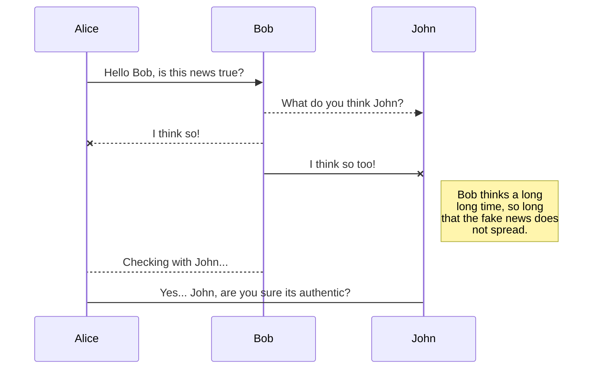
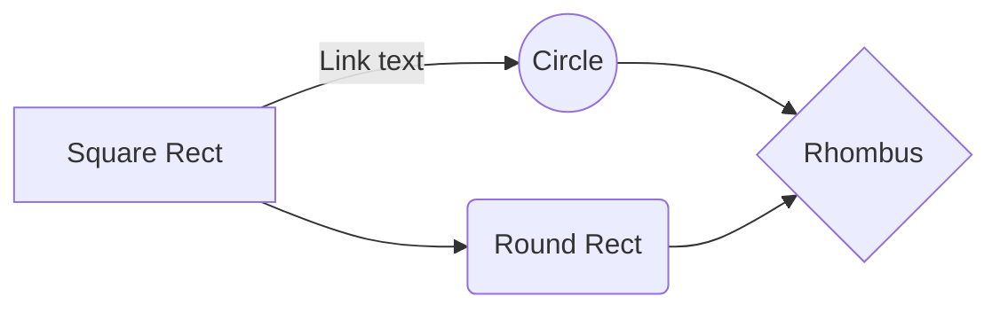

![INFO7500 17426 Cryptocurrency/Smart Contract SEC 03 Fall 2019 [BOS-2-TR]](https://i.ytimg.com/vi/ZFb01yTR9bA/maxresdefault.jpg)

# Welcome to Authentikos!

# A simple DApp to upload a document to IPFS and then store the IPFS hash on the Ethereum blockchain. Once the IPFS hash number is sent to the Ethereum blockchain, the user will receive a transaction receipt. We will use Create-React-App framework to make a front-end. This Dapp works with any user that has MetaMask installed in their Chrome browser.

Here we navigate the rough waters that have arose from the rise of Artificial Intelligence and Fake News. The Distributed Media Integrity dApp **Authentikos** is here to combat the rise of DeepFake and the accompanying social disorder it threatens to create. We use the power of **Blockchain** to gain insights that have never been uncovered before. Once you have finished with running our code, you will have gained a new appreciation for the revolutionary **Interplanetery File System** and hopefully learnt some Solidity along the way.

---

# How it works


## Prerequisites

|                |Minimum               |Preferred                       |
|----------------|----------------------|--------------------------------|
|Node            |`'v10.x.x`            |'v10.15.0 for long term support'|
|npm             |`"v6.x.x"`            |"v6.6.0"            |

## Running It Locally

Clone this repo via to your local machine and install the dependencies by doing the following:

```bash
git clone https://github.com/srinjoychakravarty/authentikos.git
cd authentikos
npm install
```

Serve the application with hot reload in a development environment via:

```bash
npm run dev
```

## Built With Love

* [Solidity](https://solidity.readthedocs.io/en/v0.5.2/) - Ethereum's smart contract programming language
* [ReactJS.js](https://reactjs.org/) - The Javascript framework used
* [web3.js](https://github.com/ethereum/web3.js/) - Javascript library used to interact with the Ethereum blockchain
* [IPFS](https://docs.ipfs.io/) - InterPlanetary File System for peer-to-peer decentralized data storage.


## UML diagrams

You can render UML diagrams using [Mermaid](https://mermaidjs.github.io/). For example, this will produce a sequence diagram:



And this will produce a flow chart:


